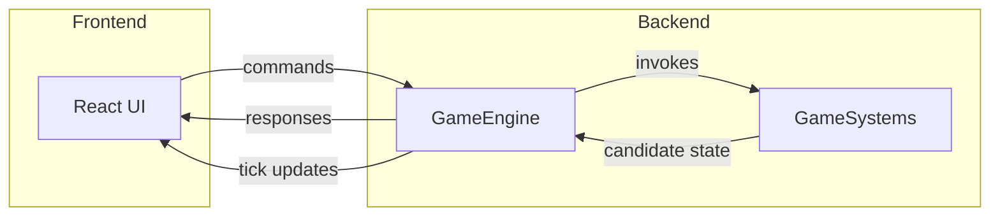

# Architecture Overview

This document outlines the high-level software architecture for the Digital Pet game. The design emphasizes a strong separation between the **frontend app** (UI layer) and the **GameEngine** with its **GameSystems**, which collectively act as a client-side "backend". The GameEngine behaves like a server that processes requests from the UI and emits time-based state updates.

There are two distinct flows:

- **User-initiated requests** are handled synchronously in a request/response cycle. The GameEngine invokes GameSystems and responds to the UI as soon as the updated `GameState` is persisted.
- **Tick-based updates** run on a schedule. The UI subscribes to these updates to reflect time-based changes even when no user actions occur.

## Frontend App (UI Layer)

- **Responsibilities**
  - Display the current `GameState` to the player using React components.
  - Capture user interactions (e.g., buttons, forms) and translate them into requests for the GameEngine.
  - Subscribe to the GameEngine for per-tick updates to keep the UI in sync with time-based changes.
  - No direct mutation of game data; all changes flow through the GameEngine.

- **Communication**
  - Sends structured commands to the GameEngine via an API-like interface.
  - Receives immediate responses for commands and separate tick-based updates from the GameEngine.

## GameEngine

- **Responsibilities**
  - Serve as the authoritative source of truth for the `GameState`.
  - Act as the central orchestrator, synchronously invoking GameSystems in a deterministic order to validate and process requests.
  - Ensure GameSystems remain isolated from one another by managing the correct call order for user requests and tick updates.
  - Collect results into a candidate `GameState` and invoke the SaveSystem to persist it before finalizing.
  - Manage a central game loop with a configurable tick rate (e.g., one tick per minute) and emit updates after each tick.
  - Process user commands outside of the tick loop so they are handled and responded to as quickly as possible.
  - Load `GameState` from local storage on startup.

- **Key Components**
  - `GameState`: Serialized data representing the pet, world, and timers.
  - `RequestHandlers`: Functions that validate and execute commands from the frontend (e.g., feed, travel, sleep).

## GameSystems

GameSystems encapsulate domain-specific logic. They never communicate directly with each other. The GameEngine synchronously invokes each system during requests and on every tick, passing slices of `GameState` and collecting their results. Systems may expose additional request handlers.

Required systems and their responsibilities:

- `SaveSystem`: Persists and loads `GameState`, supports export/import, and handles version migrations.
- `InventorySystem`: Manages items, currency balances, and item usage effects.
- `CareSystem`: Tracks Satiety, Hydration, Happiness, hidden Life, decay over time, feeding, drinking, playing, and Poop spawning/cleaning.
- `ConditionSystem`: Applies and resolves sicknesses and injuries, including timers and treatments.
- `SleepSystem`: Handles sleep/wake transitions, Energy restoration, and forced wake penalties.
- `TravelSystem`: Moves the pet between locations, applies Energy costs, and schedules travel timers.
- `ActivitySystem`: Runs timed activities at locations, consumes Energy, and grants rewards such as items, currency, or eggs.
- `TrainingSystem`: Conducts stat training sessions, consumes Energy, and manages learning new moves.
- `BattleSystem`: Resolves turn-based combat using pet stats, moves, Action costs, and battle rewards.
- `GrowthSystem`: Manages growth stage gating, advancement criteria, and stat bonuses on stage transitions.
- `EventSystem`: Tracks calendar events, handles join/leave flows, distributes rewards, and refunds Energy on cancellation.

Systems should be stateless where possible, operating only on slices of `GameState` provided by the GameEngine.

## Data Flow

### User-Initiated Flow

1. **User Action**: The UI sends a command (e.g., `FeedPet`) to the GameEngine.
2. **Processing**: The GameEngine synchronously invokes relevant GameSystems to produce a candidate `GameState`.
3. **Persistence**: The GameEngine asks the SaveSystem (a GameSystem) to store the candidate state.
4. **Response**: Upon a successful save, the GameEngine returns a result and/or updated `GameState` to the UI.

### Tick Update Flow

1. **Tick**: On each tick, the GameEngine invokes relevant GameSystems to update timers and other time-based mechanics.
2. **Persistence**: The GameEngine asks the SaveSystem (a GameSystem) to store the updated `GameState`.
3. **Broadcast**: The GameEngine emits the latest `GameState` to the UI so it can reflect time-based changes.

## Benefits

- Clear separation of concerns: UI focuses on presentation while the GameEngine enforces game rules.
- Deterministic state management centralized in the GameEngine.
- Replaceable UI layer or systems without affecting the core engine.
- Facilitates testing GameSystems independently from the UI.
